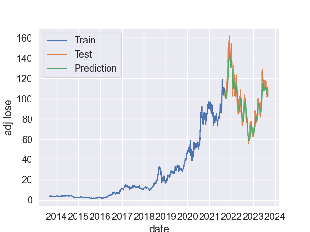
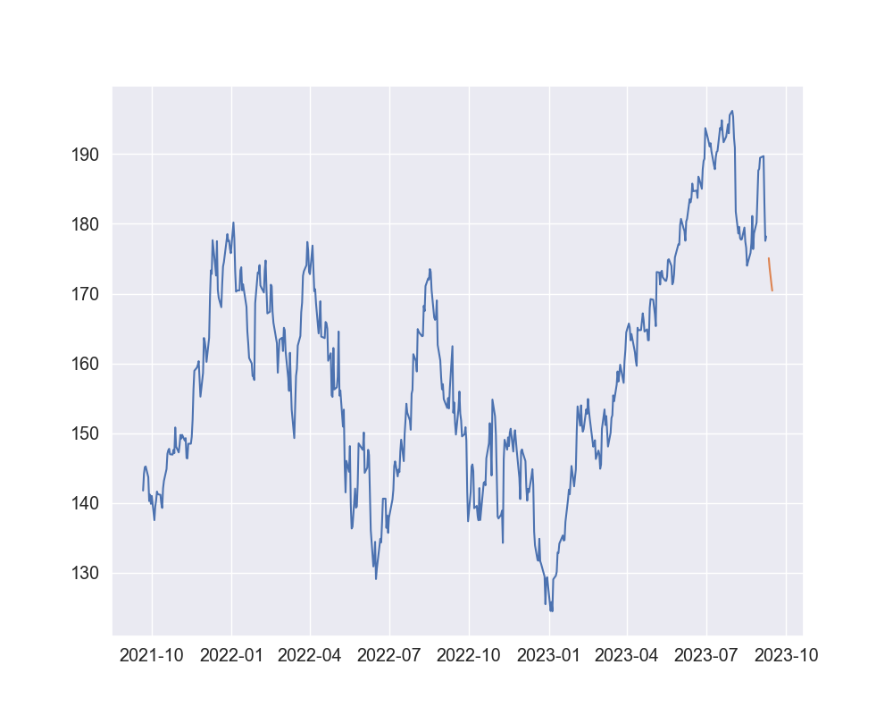
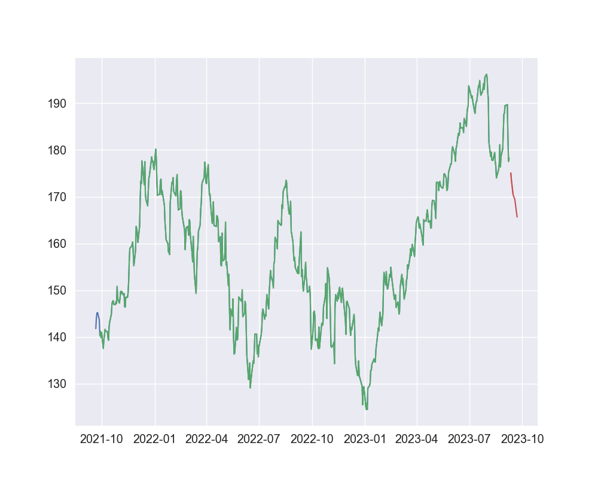

# stock-price-prediction
# Project Description
    The business idea behind the project is to have a system that can provide predicted prices of a stock in the future - 5 days.
    Based on the forecast prices, the user can have more information to make informed decision to buy or sell on a market and be a winner.
# Project Structure
## Models
- The folder contains the models as a result after training. 
## Output
- The folders contains the visualization figures of data preprocessing steps
## Src/modules
- data_preprocessing.py: contains functions for data preprocessing
- data_visualization.py: contains functions for plotting data
- modeling.py: contains function to create model
## Templates
- index.html: home page for Stock Price Predictor
## app.py
- Flask file to receive the request and return the response
## experiments_optimize.ipnyb
- Notebook file to preprocess data, build model, train model and prediction

## Evaluation
The model does good, comparing testing data and prediction data. They are on the same trend and similar values.

## Predictions
- Predict values in next 5 days
- 
- Predict values in next 10 days
- 
# Future Works
As the stock market is highly impacted by the news, media. It should be good to add an indicator to address the positive/negative thinking about a stock using sentiment analysis on the platforms such as facebook, twitter...